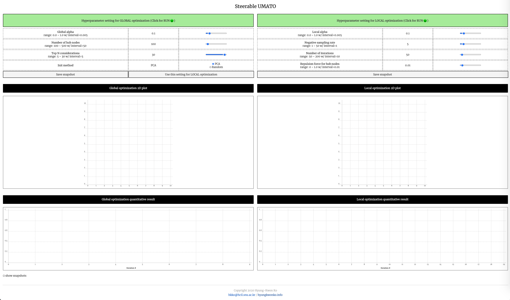
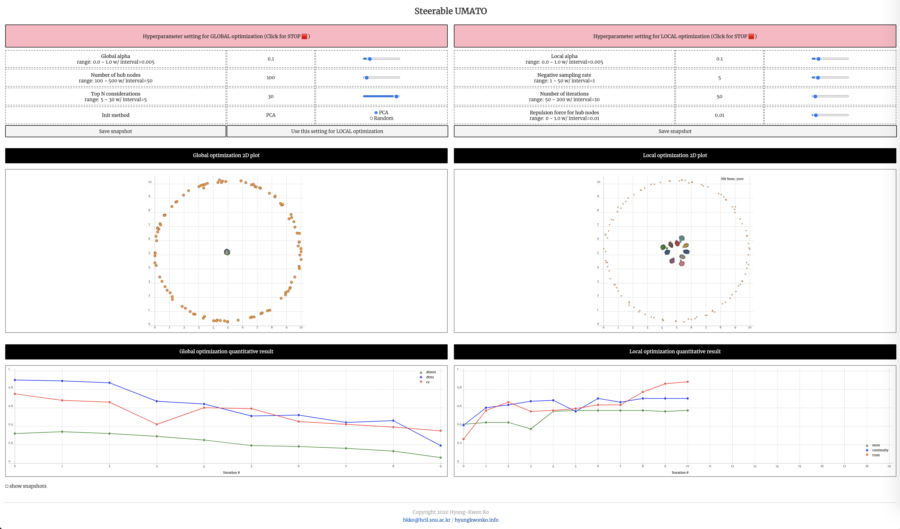

# Steerable UMATO



Steerable UMATO is an interactive web system for [UMATO](https://github.com/hyungkwonko/umato), which leverages two-phase optimization for dimensionality reduction. As there are many hyperparameters used in the algorithm, steerable UMATO provides an interactive way to explore such diversities for the best projection result. It consists of two main parts, global structure view (left half) and local structure view (right half). You can see the demo [here](https://hyungkwonko.github.io/steerable-umato/).

## Running the app locally
1. Download the source code
```bash
git clone https://github.com/hyungkwonko/steerable-umato.git
```

2. Install requirements
```bash
npm i
```

3. Run on a local machine
```bash
npm run dev
```